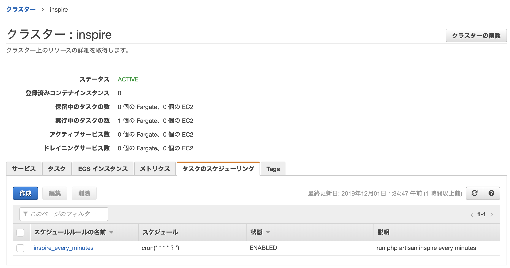
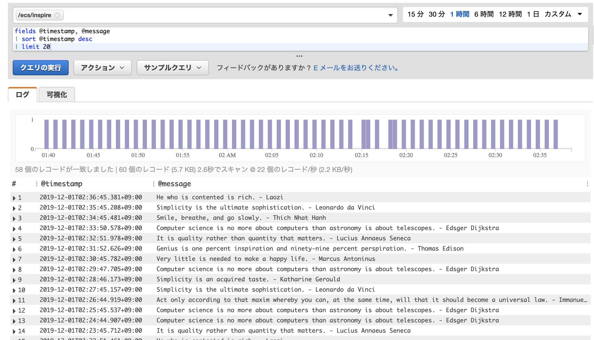

ECS Task Scheduling by Terraform with Laravel
====

## Requirements

```bash
$ terraform version
Terraform v0.12.15
+ provider.aws v2.40.0
+ provider.template v2.1.2
```

## Initialize Terraform

```bash
# Install Terraform
$ brew install terraform

# Create and edit terraform.tfvars
$ cp example.tfvars terraform.tfvars
$ vim terraform.tfvars

# And then, initialize
$ terraform init
```

## Create AWS resources by Terraform

```bash
$ terraform plan
$ terraform apply
...(snip)...
Outputs:

aws_ecr_url = 123456789012.dkr.ecr.${YOUR_REGION}.amazonaws.com/inspire:latest
```

Copy `aws_ecr_url` to your clipboard.
Use it in next step.

## Build and push Docker image

```bash
$ docker build -f docker/php-fpm/Dockerfile -t 123456789012.dkr.ecr.${YOUR_REGION}.amazonaws.com/inspire:latest .
$ $(aws ecr get-login --region ${YOUR_REGION} --no-include-email --profile ${YOUR_PROFILE})
$ docker push 123456789012.dkr.ecr.${YOUR_REGION}.amazonaws.com/inspire:latest
```

## Check your ECS Task Scheduling!!



## Clean up

```bash
$ terraform destroy
```